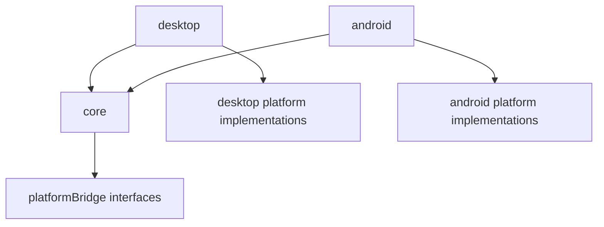

# ENGINE_INTERNALS_MAP_FOR_CODEX (Engine-Source Focused)

Open this file only when you are working on Seal Engine 3-M itself (engine bugs, engine features, platform adapter changes, performance work).

If you are working on an application that depends on the engine as a compiled JAR/AAR, start with `PROJECT_MAP_FOR_CODEX.md` instead and treat engine source reading as optional.

## 1. Repository Overview (Engine Source)

- This repository is the Seal Engine 3-M engine codebase (Gradle multi-module).
- Modules:
  - `core/`: platform-agnostic runtime and most public APIs
  - `desktop/`: desktop (LWJGL/Skija/BasicPlayer) platform adapter + launcher
  - `android/`: Android GLES platform adapter + launcher (Android library module)
- `README.md` is the public, user-oriented documentation and API manual.

## 2. Recommended Reading Order (Engine Work)

1. `README.md`
2. `core/src/main/java/com/nikitos/Engine.java`
3. `core/src/main/java/com/nikitos/CoreRenderer.java`
4. `core/src/main/java/com/nikitos/GamePageClass.java`
5. `core/src/main/java/com/nikitos/platformBridge/PlatformBridge.java` and related bridge interfaces
6. Platform bootstrap/launcher:
   - `desktop/src/main/java/com/nikitos/platform/DesktopLauncher.java`
   - `android/src/main/java/com/seal/gl_engine/platform/AndroidLauncher.java`
7. Then dive by subsystem (camera, shaders, vertices, touch, VRAM lifecycle).

## 3. Key Engine Concepts (Source-Level)

### 3.1 Page-based lifecycle and ownership

- The dominant app model is page-based: application code defines `GamePageClass` implementations.
- Many engine objects accept a `GamePageClass creator` (or similar) and treat it as an ownership key.
- Page changes (`Engine.startNewPage(...)`) trigger cleanup/reset in page-scoped registries (VRAM objects, shaders, touch processors).

This page-scoping behavior is one of the most important architectural constraints; changing it can easily cause leaks or cross-page corruption.

### 3.2 Platform bridge pattern

- `core` stays platform-agnostic by depending on platform bridge interfaces.
- `desktop` and `android` provide concrete implementations for GL calls/constants, images/fonts, asset loading, audio, and error/logging.

Key packages:

- `core/src/main/java/com/nikitos/platformBridge/*` (interfaces/contracts)
- `desktop/src/main/java/com/nikitos/platform/*` (desktop implementations)
- `android/src/main/java/com/seal/gl_engine/*` (Android implementations; note different package root)

### 3.3 Render loop driver

- `CoreRenderer` is the platform-independent render-loop driver.
- Changes here affect every platform and every frame.

### 3.4 GPU resource lifecycle (VRAM)

- `VRAMobject` is the base for GPU-backed resources tracked globally.
- The system supports deletion and reload (e.g., on page changes or GL context recreation).

This is a high-risk area: memory leaks, stale GL handles, and “works on desktop but not Android” bugs often originate here.

## 4. Source Navigation (Where Things Live)

### 4.1 Public / application-facing APIs (start here)

- `core/src/main/java/com/nikitos/Engine.java`
- `core/src/main/java/com/nikitos/GamePageClass.java`
- `core/src/main/java/com/nikitos/platformBridge/LauncherParams.java`
- `core/src/main/java/com/nikitos/main/camera/*` (camera/projection)
- `core/src/main/java/com/nikitos/main/images/*` (`PImage`, `PFont`, image/font bridges)
- `core/src/main/java/com/nikitos/main/vertices/*` (`Shape`, `Polygon`, `SimplePolygon`, `SkyBox`, etc.)
- `core/src/main/java/com/nikitos/main/frameBuffers/*` (`FrameBuffer`)
- `core/src/main/java/com/nikitos/main/touch/*` (`TouchProcessor`)
- `core/src/main/java/com/nikitos/main/keyboard/*` (`KeyListener`, `KeyReleasedListener`, `KeyComboListener`, `KeyboardProcessor`)
- `core/src/main/java/com/nikitos/maths/*` (`PVector`, `Vec3`, `Matrix`, `Section`)

### 4.2 Engine internals / lower-level subsystems

- `core/src/main/java/com/nikitos/CoreRenderer.java`
- `core/src/main/java/com/nikitos/main/VRAMobject.java`
- `core/src/main/java/com/nikitos/main/shaders/*` (program creation, adaptor binding, shader data forwarding)
- `core/src/main/java/com/nikitos/main/vertex_bueffer/*` (vertex buffer/VAO wrappers; note the package typo)
- `core/src/main/java/com/nikitos/utils/*` (global screen/time helpers; cross-cutting)
- `core/src/main/java/com/nikitos/main/debugger/*` (debug overlay and debug values)

### 4.3 Platform entry points

- Desktop:
  - `desktop/src/main/java/com/nikitos/platform/DesktopLauncher.java`
  - desktop GL/touch/audio/adapters under `desktop/src/main/java/...`
- Android:
  - `android/src/main/java/com/seal/gl_engine/platform/AndroidLauncher.java`
  - `android/src/main/java/com/seal/gl_engine/OpenGLRenderer.java` (GLSurfaceView renderer adapter)
  - `android/src/main/java/com/seal/gl_engine/touch/AndroidMotionEventAdapter.java`

## 5. Subsystem Notes (What To Expect Internally)

### 5.1 Camera and matrix model

- `Camera` contains `CameraSettings` and `ProjectionMatrixSettings`.
- `Matrix` is a static wrapper over platform-specific matrix operations and is initialized by `Engine`.

### 5.2 Shader system

- `Shader` loads shader sources and creates GL programs.
- `Adaptor` implements attribute/uniform binding strategy.
- `ShaderData` is a uniform-data forwarding mechanism often used by lighting/material classes.

Implication: custom shader work usually requires a matching adaptor and careful uniform location handling.

### 5.3 Lighting/material

- Lighting/material classes (ambient/directional/point/source light, material, exposure) are primarily shader-uniform carriers.
- They are typically page-scoped through the shader data forwarding mechanism.

### 5.4 Input/touch threading model

- `TouchProcessor` buffers callbacks and processes them later (render-thread oriented).
- This design avoids GL-thread/context issues but means “touch happens later” is normal.

### 5.5 Keyboard input model

- `KeyboardProcessor` buffers key callbacks and executes them later from the render thread via `KeyboardProcessor.processKeys()` (called from `CoreRenderer.draw()`).
- Page scoping is handled similarly to touch: `Engine.startNewPage(...)` triggers `KeyboardProcessor.onPageChange()` to drop listeners created by the previous page (unless created with `creatorPage == null`).
- `KeyComboListener` calls its callback once when all keys from the combo are pressed together (order-independent), and becomes ready again after any combo key is released.
- Platform forwarding:
  - Desktop: `desktop/src/main/java/com/nikitos/platform/DesktopLauncher.java` forwards GLFW key press/release.
  - Android: `android/src/main/java/com/seal/gl_engine/platform/AndroidBridge.java` forwards key events from the `GLSurfaceView` (focus required).

## 6. Dependency and Interaction Maps

### 6.1 Module-level dependency direction



### 6.2 Runtime interaction (high level)

```text
DesktopLauncher / AndroidLauncher
  -> Engine
  -> CoreRenderer
  -> current GamePageClass
     -> Camera / PImage / Shape / Polygon / TouchProcessor / Shader / Light / FrameBuffer
  -> post-frame systems
     -> VerticesShapesManager
     -> Debugger
     -> TouchProcessor queue
```

## 7. Risky Hotspots (Be Careful)

High blast-radius code (changes can affect all games/apps and both platforms):

- `core/src/main/java/com/nikitos/CoreRenderer.java`
- `core/src/main/java/com/nikitos/Engine.java`
- `core/src/main/java/com/nikitos/platformBridge/*`
- `core/src/main/java/com/nikitos/main/VRAMobject.java`
- `core/src/main/java/com/nikitos/main/shaders/*` (especially binding/adaptors and global registries)
- `core/src/main/java/com/nikitos/main/touch/TouchProcessor.java`
- `core/src/main/java/com/nikitos/utils/Utils.java`

## 8. Conventions and Gotchas

- `core` must remain platform-agnostic; platform code goes behind bridge interfaces.
- Registries/global managers are used in multiple subsystems (`VRAMobject`, `Shader`, `TouchProcessor`, `VerticesShapesManager`, `Animator`, `Debugger`).
- Some naming is inconsistent and should be treated as legacy:
  - `vertex_bueffer` typo in package name
  - `AudioPLayerDesktop` capitalization inconsistency
  - Android package root is `com/seal/gl_engine/*`, not `com/nikitos/*`

## 9. Items That Often Need Verification

- Asset loading behavior differences between Android and desktop packaging.
- GL context recreation behavior (especially on Android) and correctness of resource reload paths.
- Audio APIs and platform-specific implementations (some methods may be stubs/partial).
